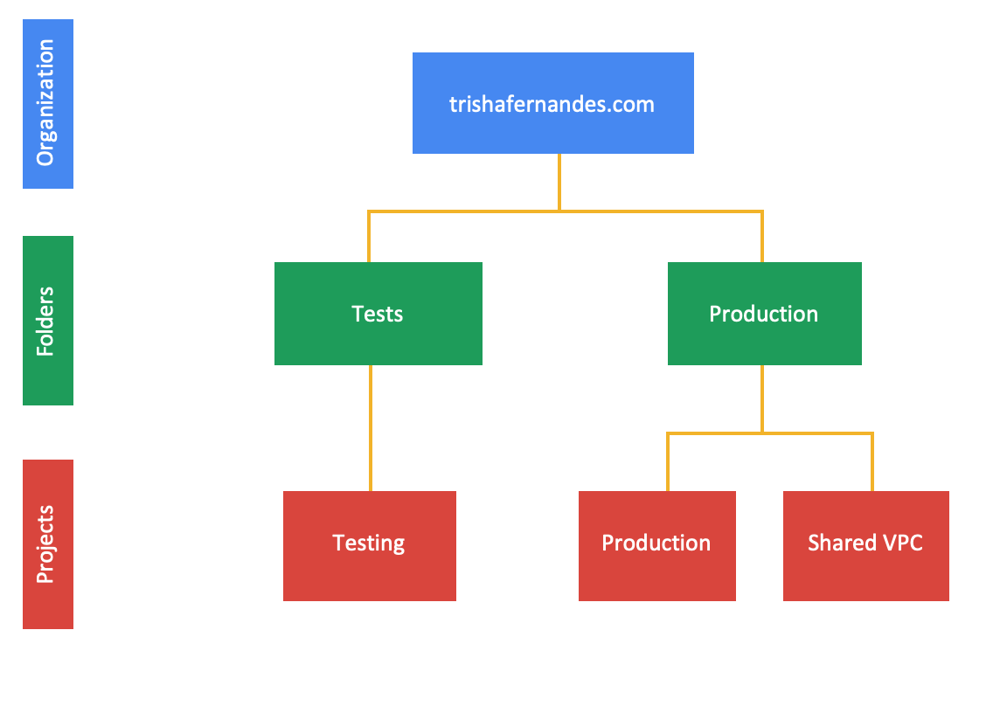
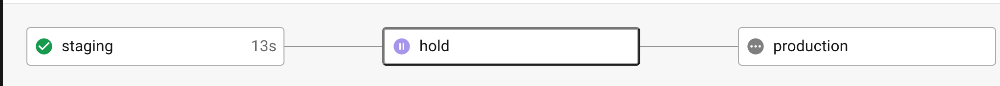

#### Introduction
This is a high-level overview on how to set up a GCP organization & host a static website. More specifically, this demonstrates how I set up my organisation, created my website and the tools used to do so, in the following steps:

1. [Buy a domain name](##1.-Buy-a-domain-name)
2. [Resolve DNS](#resolve-dns)
3. [Set up identity management](#set-up-identity-management)
4. [Set up organisation](#####4.set-up-organisation)
5. [Host website](#hosts-website)
6. [Apply CI/CD](#apply-ci-cd)

##### 1. Buy a domain name

The first step is to register a domain name with a registrar. I bought my domain name on [namecheap](https://www.namecheap.com/). There are many popular domain registrars you can choose from depending on the pricing structures, bundles and web hosting options and other add-on services. Some examples are [GoDaddy](https://uk.godaddy.com/domains/domain-name-search), [Domain.com](https://www.domain.com/domains) and [Google Domains](https://domains.google/).

Some of the reasons to go with [namecheap](https://www.namecheap.com/) are its ease of use, free Whois privacy and as the name suggests, it's relatively cheap.

##### 2. Resolve DNS

Namecheap offers a default DNS service, as is with most domain name registrars. But, these are very basic free DNS services and usually lack advanced DNS capabilities; this is where [Cloudflare DNS](https://dash.cloudflare.com/sign-up) comes in. Having the fastest authoritative DNS in the world, built-in DDoS protection and its 100% uptime, are just a few of the reasons to choose Cloudflare DNS.

Some alternatives to Cloudflare DNS are [Google Cloud DNS](https://cloud.google.com/dns), [Amazon Route 53](https://aws.amazon.com/route53/), [OpenDNS](https://www.opendns.com/) etc.

You can use [this guide](https://www.namecheap.com/support/knowledgebase/article.aspx/9607/2210/how-to-set-up-dns-records-for-your-domain-in-cloudflare-account/) to change the nameservers to Cloudflare.

##### 3. Set up identity management

Identity management has to be set up to enable organisations to use single sign-on (SSO using SAML or OIDC), authentication and access controls. To use Google Cloud, you must use a Google identity service. My "Identity as a service (IDaaS)" provider of choice for my organisation was Cloud Identity (free edition). You could, however, also use Cloud Identity Premium Edition or Google Workspace (formerly called G Suite).  

Other identity management offerings outside of Google Cloud are:

- Okta
- OneLogin
- Auth0
- Microsoft Azure Active Directory

but these pose other requirements.
If you are already using a non-Google identity provider, you still need a Google identity account using Cloud Identity or Workspace.

Follow [section 1](https://cloud.google.com/docs/enterprise/setup-checklist#checklist-section-1) in the Google Cloud provided checklist to set up a Cloud Identity account and verify your domain.

##### 4. Set up organization

Once you verify your domain, an organization resource gets automatically created for you in GCP.

In the same checklist, follow [sections 2-6](https://cloud.google.com/docs/enterprise/setup-checklist#checklist-title) to add users and groups to your identity account, set up administrator access, billing, resrouce hierarchy and IAM. You can follow the rest of the checklist if required, but in this case, there is no need to sign up for any support services, set up networking or other configurations.

This is what my organisation structure looks like (up to project level):

##### 5. Host website

After setting up your organization, the next step is to host the website.

*Note: My static website was built using [Hugo](https://gohugo.io/).*

I opted to host my website on [Google Cloud Storage (GCS)](https://cloud.google.com/storage) to make it all GCP linked. However, you can host a static website on other platforms, such as [Netlify](https://www.netlify.com/), [AWS S3](https://aws.amazon.com/s3/), [GitHub Pages](https://pages.github.com/) etc.
The key reasons for choosing GCS are the fast, low-cost and highly available storage options it offers.

Follow the steps below to configure a GCS bucket to host your website:

- [Create a GCS bucket](https://cloud.google.com/storage/docs/creating-buckets) and remember to give your bucket the same name as your domain
- [Share your files](https://cloud.google.com/storage/docs/hosting-static-website#sharing) by making your bucket publicly readable
- [Assign specialty pages](https://cloud.google.com/storage/docs/hosting-static-website#specialty-pages)
- [Upload your website's files](https://cloud.google.com/storage/docs/hosting-static-website#uploading) to the bucket
- Point your domain to GCS by updating CNAME record to **c.storage.googleapis.com** on Cloudflare or your Domain Registrar

I have a development website/subdomain separate from the main website that houses all content until it is ready to be released and published into the main website, and because I have both testing and production projects/websites, I have one bucket per project, with the corresponding domain names as bucket names.

##### 6. Apply CI/CD

I have to manually deploy content to both development and production on my website which can be quite challenging if operating in a large organization and as code grows larger and more complex. These manual operations can be avoided by implementing CI/CD into the code.

[CircleCI](https://circleci.com/) was my CI/CD tool of choice but you can use [Jenkins](https://jenkins.io/), [GitHub Actions](https://github.com/features/actions), [Travis CI](https://www.travis-ci.com/) etc. depending on your requirements.

My CI/CD pipeline is a fairly straightforward - once a Pull Request is raised on my GitHub repository, the blog post gets published to my development website. The only manual action to do is to verify if the blog content is as expected, and if it is, click the "Approve" button and the changes are pushed to the main website.

This is what the CircleCI workflow looks like:

And that's it! These are just simple steps to get up and running with your GCP organization and static website.

***All code for my website is publicly available on my GitHub.***